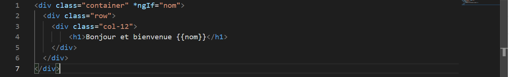
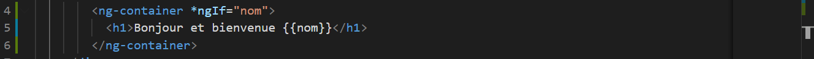
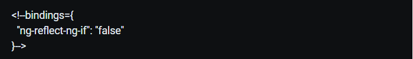
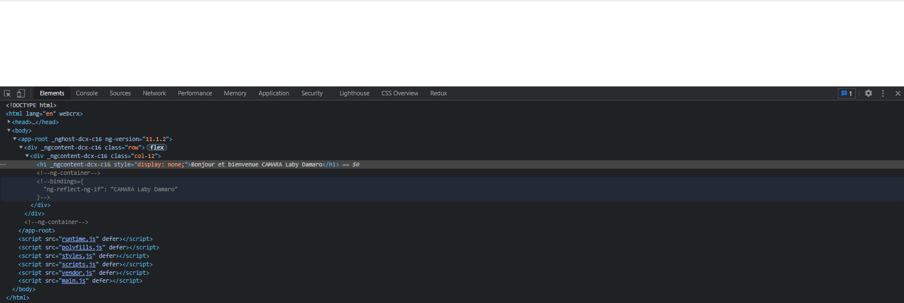
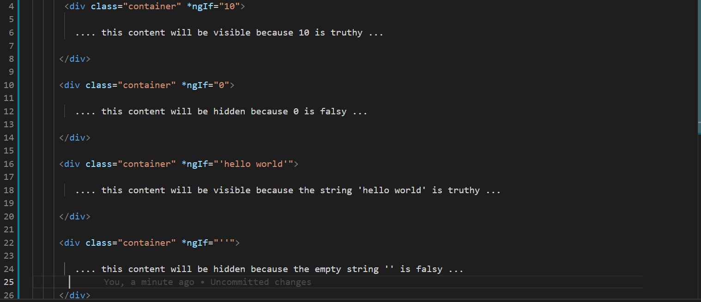
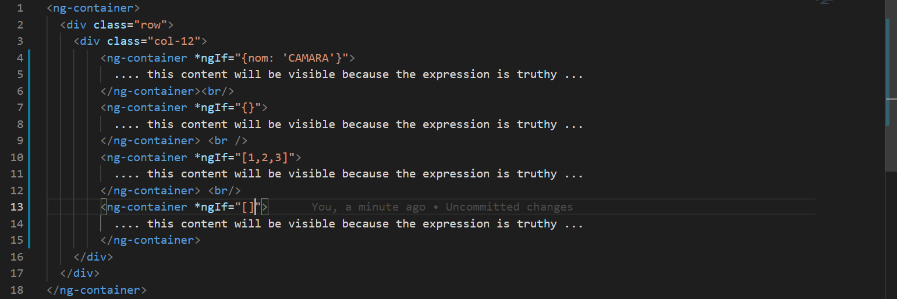

# Angular ngIf : Guide completomprendre-ngif-angular
Apprenez toutes les fonctionnalités disponibles dans ngIf, apprenez la meilleure façon de l'utiliser pour consommer des Observables, évitez un anti-modèle commun.

## Résumé de NgIf
Dans cet article, nous allons couvrir toutes les fonctionnalités dont nous disposons pour utiliser la directive principale Angular <code>ngIf</code>.

Outre les fonctionnalités les plus couramment utilisées, nous allons apprendre à éviter un **anti-pattern** <code>ngIf</code> potentiel que nous pourrions rencontrer tout en développant des écrans d'interface utilisateur plus complexes qui consomment beaucoup de données observables provenant de différentes sources <code>(backend, services observables, magasins , etc.)</code>.

## Table des matières
Dans cet article, nous aborderons les sujets suivants :
* Qu'est-ce qu'Angular <code>ngIf</code> ?
* Comment <code>ngIf</code> se compare-t-il au masquage d'éléments à l'aide de CSS ?
* Quel type d'expressions <code>ngIf</code> peut-il accepter ?
* La syntaxe <code>ngIf else</code>
* La syntaxe <code>ngIf if then else</code>
* Consommer des données observables avec <code>ngIf</code> et le <code>async pipe</code>
* Un potential anti-pattern potentiel lors de la consommation de données **observables** avec <code>ngIf</code>
* Le modèle Single Data Observable
* Comment <code>ngIf</code> fonctionne-t-il sous le capot ?
* Résumé

Cet article est la traduction la série en cours sur les fonctionnalités d'Angular Core, vous pouvez trouver tous les articles disponibles [ici](https://blog.angular-university.io/tag/angular-core/).

Alors sans plus tarder, commençons à apprendre tout ce que nous devons savoir sur Angular ngIf !

## Qu'est-ce qu'Angular ngIf ?
Même si HTML est aussi un langage de programmation à part entière, il n'a pas d'instruction if, contrairement par exemple à Javascript.

La directive Angular ngIf fonctionne essentiellement comme une instruction if pour HTML, ajoutant cette fonctionnalité manquante au langage sous la forme de l'attribut spécial ngIf.

>La directive Angular ngIf fonctionne essentiellement comme une instruction if pour HTML, ajoutant cette fonctionnalité manquante au langage sous la forme de l'attribut spécial ngIf.

Nous devons passer une condition à <code>ngIf</code>, pour que cela fonctionne. Voici quelques exemples:

Dans cet exemple, le container div ne sera affiché que si la variable nom est défini , sinon tout le contenu du div ne sera pas visible.
### Et si je n'ai aucun endroit pratique pour appliquer ngIf ?
Dans le cas des éléments **container**, s'il n'y a pas de **container** disponible pour la section que nous voulons afficher ou masquer, nous n'avons pas besoin de créer un **container div** juste pour pouvoir appliquer <code>ngIf</code>.

Au lieu de cela, nous pouvons appliquer <code>ngIf</code> au-dessus de la directive <code>ng-container</code>. Cela affichera ou masquera le contenu de <code>ng-container</code>, sans avoir à créer un **div** supplémentaire juste pour cela :

### Comment ngIf se compare-t-il au masquage d'éléments à l'aide de CSS ?
Même si **HTML** n'a pas d'instruction if intégrée, il existe des moyens de masquer des parties de la page avec simplement du CSS, en utilisant la propriété <code>display</code> et
 <code>visibility</code>.

Nous pouvons facilement ajouter ou supprimer ces attributs CSS à un élément HTML en utilisant Javascript et **hide** un élément de la page. Mais ce n'est pas la même chose que d'utiliser **ngIf**.

Avec **ngIf**, si un élément est caché, cet élément n'existe pas du tout dans la page.

Cela signifie que si vous inspectez la page à l'aide par exemple des outils de développement Chrome, vous ne trouverez aucun élément HTML présent dans le **DOM**.

Au lieu de cela, vous trouverez un commentaire HTML d'aspect étrange similaire à celui-ci, où la directive ngIf a été appliquée :

>Ce commentaire est là uniquement à des fins de débogage, pour aider à identifier où l'élément manquant aurait dû être placé au cas où il était visible.

Ceci est très différent du comportement des propriétés CSS <code>display</code> ou de <code>visibility</code>. Par exemple, si nous définissons la propriété <code>display</code> sur la valeur **none**, l'élément HTML sera masqué.

Mais si on inspecte la page avec les Dev Tools, on verra que les éléments DOM sont toujours là présents sur la page, c'est juste qu'ils ne sont pas visibles :

Avec la propriété **display** CSS défini sur **hiden**, quelque chose de très similaire se produirait. L'élément HTML serait caché à l'utilisateur, mais toujours présent sur la page lors de l'inspection avec **Dev Tools**.

Avec une **hidden visibility**, l'élément occupera toujours un espace vide sur la page, même si l'élément est masqué. Ceci est différent de l'utilisation de **display:none**, où aucun espace sur la page n'est occupé.

Mais dans les deux cas, avec **CSS**, les éléments sont toujours présents dans le **DOM**, consommant des ressources aussi petites soient-elles, contrairement à <code>ngIf</code> où les éléments cachés n'existent tout simplement pas.

>En général, lors de la création d'applications angulaires, nous devrions toujours préférer masquer les éléments à l'aide de <code>ngIf</code> au lieu d'utiliser du **CSS** simple.

## Quel type d'expressions ngIf peut-il accepter ?
La directive <code>ngIf</code> peut prendre en entrée n'importe quelle expression Typescript valide et pas seulement un booléen. La véracité de l'expression va ensuite être évaluée, pour déterminer si l'élément doit être affiché ou non.

Outre les booléens, nous pouvons également transmettre à ngIf par exemple des chaînes, des tableaux, des objets, etc. Voici quelques exemples de ce qui se passerait si nous passions d'autres types primitifs à <code>ngIf</code> :

Et voici d'autres exemples de transmission de tableaux et d'objets à ngIf :

